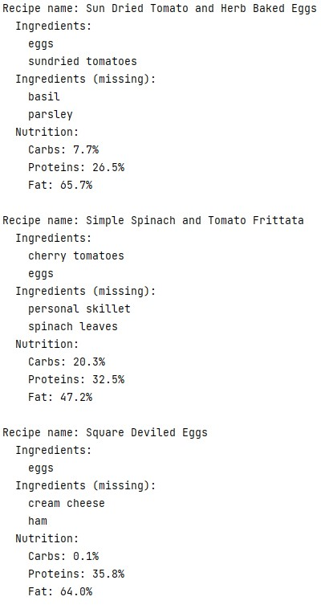

# WhatCanIEat
Being hungry while the fridge is full?  
Provide me a list of ingredients you have and cook something together!

## Description
This app takes ingredients and number of recipes to generate. 
Then fetches them from [Spoonacular](https://spoonacular.com/food-api) api.
Results are cached in mssql database.

## Setup
Env variables: 
- SPOONACULAR_API_KEY - Spoonacular api key
- DB_SERVER - database url
- DB_PORT
- DB_USERNAME
- DB_PASSWORD
- DB_DATABASE

## Usage
CLI flags:   
- **--ingredients** 
- **--numberOfRecipes**

Example `--ingredients=tomatoes,eggs,pasta --numberOfRecipes=5`

## Example result

## Dependencies
[cobra](https://github.com/spf13/cobra)